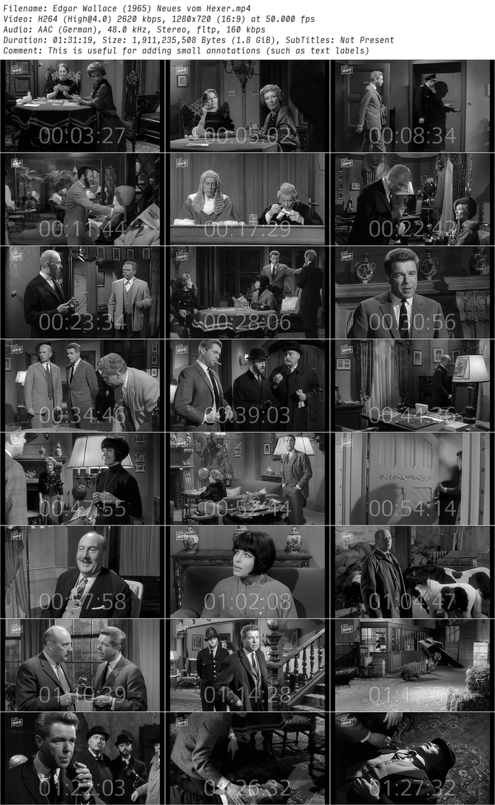
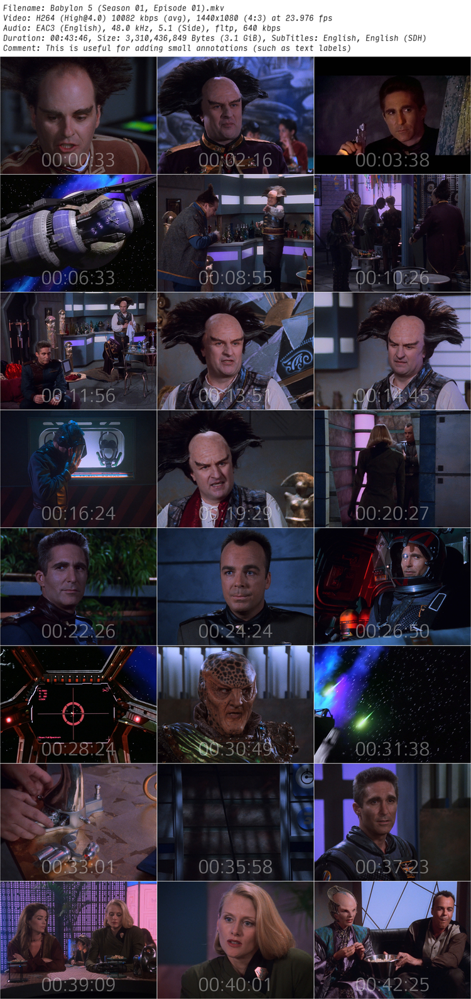
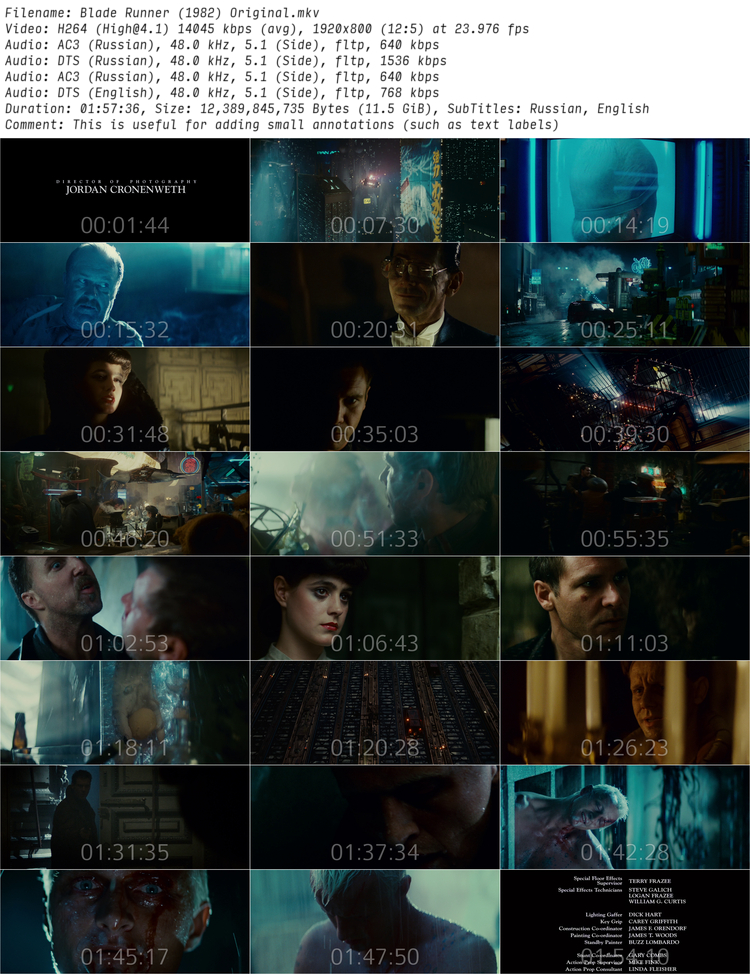

## PROJECT ##

* ID: **T**humbnail!**M**AKER
* Contact: git@schepsen.eu

## DESCRIPTION ##

**T**humbnail!**M**AKER creates customisable thumbnails and adds some tech details in the picture's header

## DEPENDENCIES ##

Attention: Don't forget to install these additional apps

* ffmpeg
* imagemagick

```
pip install -r requirements.txt
```

## USAGE ##

tnmake [-h] -i path [-o filename] [-q percentage] [-w px] [-c annotation] [-g layout] [-e {bmp,jpg,png}] [-f path] [-v] [-V]

*  -h, --help

 show this help message and exit

*  -i path, --input path

set video file path

*  -o filename, --output filename

set custom output filename

*  -q percentage, --quality percentage

set output image quality (default: 100)

*  -w px, --width px

set width of output image

*  -c annotation, --comment annotation

add a comment as a thumbnail annotation

*  -g layout, --grid layout

set layout of a resulting thumbnail

*  -e {bmp,jpg,png}, --extension {bmp,jpg,png}

choose the output extension (default: "jpg")

*  -f path, --font path

set path to a fontfile (default: "Mono Input Condensed (Light, Italic)")

*  -v, --verbose

enable verbose mode

*  -V, --version

show program's version number and exit


### EXAMPLES ###

```
tnmake -i "Blade Runner (1982) Original.mkv" -w 750 -c "This is useful for adding small annotations (such as text labels)"
```

<details>
<summary>Example 1: Edgar Wallace (1964) Der Hexer</summary>


</details>

<details>
<summary>Example 2: Babylon 5 (S01E01)</summary>


</details>

<details>
<summary>Example 3: Blade Runner (1982) Original</summary>



</details>

## CHANGELOG ##

### Thumbnail!MAKER 0.2.0, updated @ 2022-11-03 ###

* add a `pip` installable package

### Thumbnail!MAKER 0.1.1, updated @ 2020-01-14 ###

* add support for `embedded` subtitles

### Thumbnail!MAKER 0.1.0, updated @ 2020-01-13 ###

* initial release
